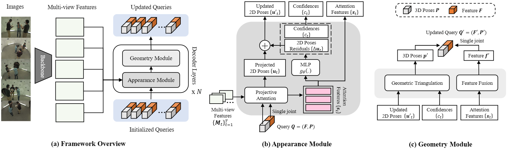
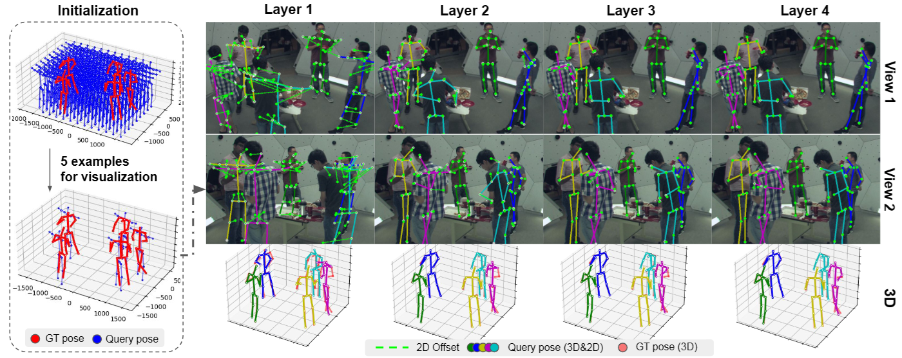

# MVGFormer: Multiple View Geometry Transformers for 3D Human Pose Estimation
### CVPR'24 [[Paper](https://arxiv.org/abs/2311.10983)] [[Poster](https://drive.google.com/file/d/1VZvKvuO3EuBBJs29mJ1uMlh4iAupSHT3/view?usp=sharing)] 

This is the official implementation of our work presented at CVPR 2024, titled ***Multiple View Geometry Transformers for 3D Human Pose Estimation***.

<!--  -->


# Framework

We **explicitly introduce multi-view geometric modules** into an end-to-end Transformers architecture for 3D human pose estimation, resulting in remarkable generalization performance across various camera settings.




## Iterative Query Updates with Transformers

We employ a coarse-to-fine query refinement process, initially randomly sampling coarse 3D queries in the areas. Subsequently, we project these coarse 3D poses onto 2D images and aggregate features using Transformer attentions to update the projected points. Finally, we use triangulation to recover more accurate 3D poses. This process is iteratively repeated in an end-to-end differentiable manner by Transformer decoder layers.



## Reference
```
@inproceedings{liao2024multiple,
  title={Multiple View Geometry Transformers for 3D Human Pose Estimation},
  author={Liao, Ziwei and Zhu, Jialiang and Wang, Chunyu and Hu, Han and Waslander, Steven L},
  booktitle={Proceedings of the IEEE/CVF Conference on Computer Vision and Pattern Recognition},
  pages={708--717},
  year={2024}
}
```

# 1. Installation


Clone the repository:

```
git clone git@github.com:XunshanMan/MVGFormer.git
```

## Dependencies

Create a conda environment:

```
conda create -n mvgformer python==3.10
conda activate mvgformer
```

Install [mmcv](https://mmcv.readthedocs.io/en/latest/get_started/installation.html) carefully with cuda version:
```
pip install -U openmim
mim install mmcv-full
```

Install the dependencies:
```
pip install -r requirements.txt
```

Compile the attention modules. Please carefully set your ```CUDA_HOME=/usr/local/cuda-*/```, where ```*``` is your cuda version:

```
cd ./lib/models/ops
CUDA_HOME=/usr/local/cuda-11.0/ python setup.py build install
```

## Dataset Prepararation

Consider the project root directory as ```${POSE_ROOT}```.

**CMU Panoptic dataset**. Please download the CMU Panoptic Dataset following [VoxelPose](https://github.com/microsoft/voxelpose-pytorch) as below:

* Download the dataset by following the instructions in [panoptic-toolbox](https://github.com/CMU-Perceptual-Computing-Lab/panoptic-toolbox) and extract them under ```${POSE_ROOT}/data/panoptic/```

* You can only download those sequences you need. You can also just download a subset of camera views by specifying the number of views (HD_Video_Number) and changing the camera order in ```./scripts/getData.sh```. The sequences and camera views used in our project can be obtained from [here](docs/CMU_sequences.md), and the ```Table A.1``` in the Supplementary Materials of [our paper](https://arxiv.org/pdf/2311.10983#page=11.29). 

* Note that we only use HD videos, calibration data, and 3D Body Keypoint in the codes. You can comment out other irrelevant codes such as downloading 3D Face data in ```./scripts/getData.sh```.

**Feature Backbone**. Please download the [PoseResNet-50 pre-trained model](https://onedrive.live.com/?authkey=%21AMf08ZItxtILRuU&id=93774C670BD4F835%211917&cid=93774C670BD4F835&parId=root&parQt=sharedby&o=OneUp) and place it at ```${POSE_ROOT}/models/pose_resnet50_panoptic.pth.tar``` (ResNet-50 pretrained on COCO dataset and finetuned jointly on Panoptic dataset and MPII).

The structure should look like this:

```
${POSE_ROOT}
|-- models
|   |-- pose_resnet50_panoptic.pth.tar
|-- data
    |-- panoptic
        |-- 16060224_haggling1
        |   |-- hdImgs
        |   |-- hdvideos
        |   |-- hdPose3d_stage1_coco19
        |   |-- calibration_160224_haggling1.json
        |-- 160226_haggling1  
        |-- ...
```

**Shelf/Campus Dataset**. Please follow [VoxelPose](https://github.com/microsoft/voxelpose-pytorch) to download 
the Shelf/Campus Dataset. 

# 2. Training

## 2.1 CMU Panoptic dataset

We train on five camera views from the camera arrangement of ```CMU0```. We trained our models on 8 GPUs and batch_size=1 for each GPU. The evaluation result will be printed after every epoch, the best result can be found in the log.

```
python -m torch.distributed.launch --nproc_per_node=8 --use_env run/train_3d.py --cfg configs/panoptic/knn5-lr4-q1024-g8.yaml
```

### Model Checkpoints

The trained model checkpoints can be downloaded as below. Please put the weights under ```models/```.

| Datasets    |  AP<sub>25</sub> |  MPJPE | pth | 
| :---        |   :---:    |   :---:  | :---:  |
| Panoptic    |    92.3    |  16.0   | [here](https://drive.google.com/file/d/1iPLyUzatBtm7iIoWoErgRXn7sS2OMTxC/view?usp=sharing) |

## 2.2 Ablation Experiments

Following Section 2.1, please change the parameters in the config file, or pass through extra parameters, such as ```DECODER.num_decoder_layers=4```, ```DECODER.num_instance=1024```, ```TRAIN.END_EPOCH=100``` to run the ablation experiments.

# 3. Evaluation

## 3.1 Generalization (Out-of-domain) Evaluation

We train our model on the CMU panoptic dataset, with the camera arrangement of ```CMU0```. We can infer the model on several out-of-domain settings, including ```Change Camera Numbers```, ```Change Camera Arrangements```, and ```Change Dataset without finetuning```. 

For CMU-panoptic dataset, you can find ready-made configuration files below `configs/panoptic/generalization`. ```EXP_TYPE``` can be ```CMU0ex3,CMU0ex4,CMU0ex6,CMU0ex7,CMU1,CMU2,CMU3,CMU4```.

```
python run/validate_3d.py --cfg configs/panoptic/generalization/{EXP_TYPE}.yaml --model_path models/mvgformer_q1024_model.pth.tar
```

You can also configure experiments with extra parameters:

* ```Change Camera Numbers```. The camera number can be ```3,4,5,6,7```:

```
python run/validate_3d.py --cfg configs/panoptic/knn5-lr4-q1024.yaml --model_path models/mvgformer_q1024_model.pth.tar DATASET.TEST_CAM_SEQ='CMU0ex' DATASET.CAMERA_NUM=7
```

* ```Change Camera Arrangements```. The camera arrangements can be ```CMU0,CMU1,CMU2,CMU3,CMU4```. Please see [here](docs/CMU_sequences.md) for the detail of each arrangements:

```
python run/validate_3d.py --cfg configs/panoptic/knn5-lr4-q1024.yaml --model_path models/mvgformer_q1024_model.pth.tar DATASET.TEST_CAM_SEQ=CMU1
```

* ```Change Dataset without finetuning```. The dataset can be ```Shelf,Campus```.

```
python run/validate_3d.py --cfg XXXX --model_path models/mvgformer_q1024_model.pth.tar --dataset Shelf/Campus
```


## 3.2 In-domain Evaluation

This experiment aims to test the in-domain performance of our model. It is trained on the camera arrangement of ```CMU0``` on the CMU panoptic dataset, and also infer with the same camera arrangement.

Infer with single GPU with ```BATCH_SIZE=1```:
```
python run/validate_3d.py --cfg configs/panoptic/knn5-lr4-q1024.yaml --model_path models/mvgformer_q1024_model.pth.tar TEST.BATCH_SIZE=1 
```

<!-- 

[TBD] Please run a demo on inference result. If using more than 1 GPU, use distributed version.

```
python ./run/validate_3d.py --cfg configs/panoptic/knn3-lr4-q1024.yaml --model_path models/trained/knn5-lr4-q1024-ap92.3.pth.tar DECODER.inference_conf_thr=\[0.1\] TEST.BATCH_SIZE=1 DECODER.filter_query=True DEBUG.LOG_VAL_LOSS=False DECODER.return_intermediate_dec=False
``` -->


## LICENSE
This repository is licensed under Apache-2.0. For commercial use, please reach out to the authors.

## Acknowledgement

Our work is based on the codebases of [MvP](https://github.com/sail-sg/mvp) and [VoxelPose](https://github.com/microsoft/voxelpose-pytorch). We deeply appreciate the authors for their invaluable contributions. 
